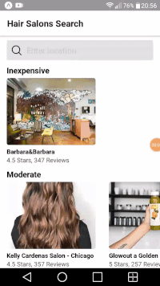

## Hair Salons Search app

I built this project in order to practice using React Native.

Using this app user can:
- search for Hair Salons by location
- see a list of Hair Salons grouped by price level
- see detailed information about selected Hair Salon

#### Install & Start

    $ git clone https://github.com/orvalho/hair-salons
    $ cd hair-salons
    $ npm install
    // get Yelp API key and put it inside src/api/yelp.js file
    $ npm start

#### App

#### Stack

-   react
-   expo
-   react-native
-   react-navigation
-   react-navigation-stack
-   @expo/vector-icons
-   axios
-   yelp api